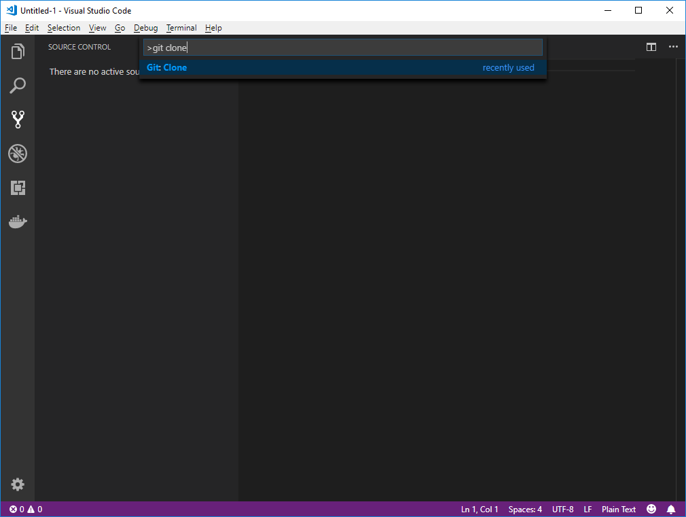
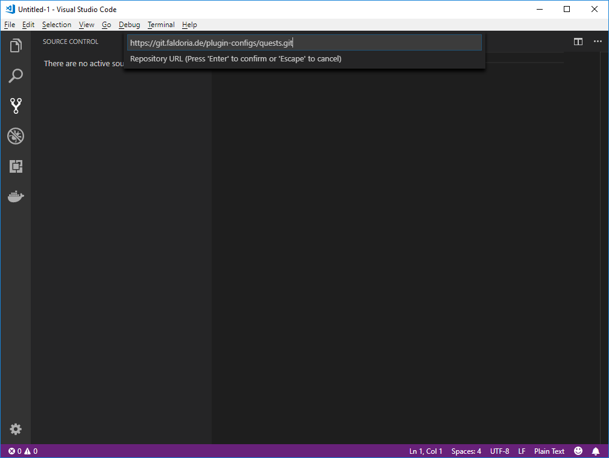

# Tales of Faldoria Quests

In diesem Git Repository befinden sich alle Informationen und Konfigurationen zu den Quests auf dem Server Tales of Faldoria. Das Repository wird sowohl von Quest Schreibern als auch Quest Entwicklern genutzt.

**Quest Schreiber** sind die kreativen unter uns und denken sich Quests aus. Die Quest und alle Informationen die dazu gehört wird dann in Ordnern und `README` Dateien strukturiert.

Die **Quest Entwickler** nutzen dann die `README` Dateien um daraus fertige Konfigurationen für das Quest Plugin zu entwerfen.

> Quest Konfigurationen befinden sich immer im selben Ordner wie die `README.md` der dazugehörigen Quest.

- [Getting Started](#getting-started)
    - [Benötigte Software](#benötigte-software)
    - [Repository Clonen](#repository-clonen)
- [Ordner Struktur](#ordner-struktur)

## Getting Started

Sowohl für das Schreiben, als auch für das Konfigurieren von Quests sollte der [Issue Tracker](https://git.faldoria.de/plugin-configs/quests/issues) genutzt werden. Dort können Aufgaben priorisiert und unter Teammitglieder aufgeteilt werden.

* [Issue Tracker](https://git.faldoria.de/plugin-configs/quests/issues)
* [Pull Requests](https://git.faldoria.de/plugin-configs/quests/milestones)
* [Quest Schreiber Dokumentation](docs/QUEST-WRITER.md)
* [Quest Entwickler Dokumentation](docs/QUEST-DEVELOPER.md)

### Benötigte Software

Alle Quest Informationen und Konfigurationen in diesem Repository werden mit [`Git`](https://de.wikipedia.org/wiki/Git) und einem Text Editor verwaltet. Daher wird folgende Software benötigt:

* [Git Client](https://git-scm.com/downloads)
* [Visual Studio Code](https://code.visualstudio.com/) - Text Editor mit Git Integration

### Repository Clonen

In Visual Studio Code <kbd>CTRL</kbd>+<kbd>SHIFT</kbd>+<kbd>P</kbd> drücken um die Command Palette aufzurufen.

`Git clone` in die Command Palette eingeben.



Folgende URL einfügen: `https://git.faldoria.de/plugin-configs/quests.git`



Anschließend den Ordner auswählen in dem die Quests gespeichert werden sollen und bestätigen.

## Ordner Struktur

Der Übersicht halber sollte alle Dateien die zu einer Quest gehören in einem Ordner und Sub-Ordnern gespeichert werden. NPCs die mehrere Quests verwenden sollten auf der höchst möglichen Ebene abgelegt werden. Das ermöglicht den Quests einen leichten Zugriff durch die Nutzung von [relativen Pfad Angaben](docs/QUESt-DEVELOPER.md#relative-pfade).

> Alle Infos die zu einer Quest gehören sollten in einer eigenen `README.md` im jeweiligen Quest Ordner gespeichert werden.

Auch [Mobs](https://git.faldoria.de/raidcraft/rcmobs) und [Custom Items](https://git.faldoria.de/raidcraft/rcitems) sollten, wenn sie nur von der Quest verwendet werden, in dem jweiligen Quest Ordner abgelegt werden.

> Die eindeutige ID einer Quest besteht aus dem Ordner Pfad und dem Quest Namen.
> z.B. `ankanor.hauptquest.1-quest-name.quest-name`

```text
quests
└── ankanor
    ├── einfache-npcs
    │   └── ...
    ├── hauptquest
    │   ├── 1-quest-name
    │   │   ├── README.md
    │   │   ├── quest-name.quest.yml
    │   │   ├── npc-name.host.yml
    │   │   ├── npc-name.default.conv.yml
    │   │   ├── unterhaltung.conv.yml
    │   │   ├── quest-item.item.yml
    │   │   ├── quest-mob.mob.yml
    │   │   └── quest-mobgruppe.mob-group.yml
    │   ├── 2-quest-name
    │   │   └── ...
    │   └── quest-übergreifender-npc.host.yml
    └── nebenquest
        └── ...
```