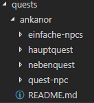
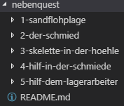

# Story und Quest Entwickler/Schreiber

Der Story und Quest Entwickler auch Questschreiber genannt, entwirft Storys und Quest für das Projekt. Hierbei nutzt er seine eigene Fantasie und kreativität um vorhandene Handlungsstränge fortzuführen oder neue hinzuzufügen. Um den [Quest-Skripter](./QUEST-DEVELOPER.md) bei ihrer arbeit, die fertig entworfenen Quest zu implemetieren, sollten Questschreiber die Quest in einem bestimmten Format, in einer Markdown Datei **(.md)** in den jeweiligen Questordner einfügen. Wie das vonstatten geht erklären wir euch in diesem Dokument.

* [Getting Started](#getting-started)
* [Der erste Schritt - Ordnerstruktur](#der-erste-schritt---ordnerstruktur)

## Getting Started

Um die `README.md` anlegen und bearbeiten zu können wird ein Account im [Gitlab von Faldoria](https://git.faldoria.de/) benötigt. Für einen Zugang bitte an `xanily` wenden.

Dort liegen auch die Ordner für die Questbearbeitung, bzw. dort werden sie abgelegt. Meist reicht es aus dort im Browser seine Datein zu bearbeiten, für alle die aber außerhalb des Browsers arbeiten wollen gibt es Editoren die das bearbeiten der Datein auch einfacher machen können. Wir empfehlen [Visual Studio Code](https://code.visualstudio.com/). Weiteres dazu auch hier unter [Tales of Faldoria Quests](../README.md).

Nun braucht es nur noch eine Idee, kreativität und motivation und schon kann man loslegen die Quest zu entwickeln.

## Der erste Schritt - Ordnerstruktur

Zunächst ist wichtig das überprüft wird ob es für das jeweilige Questgebiet schon die Ordnerstruktur vorhanden ist.  

Dies ist die Ordnerstruktur der Insel Anakanor. Sie ist aufgespalten in zwei Hauptordner `/ankanor` und `/ankanor-event`, dann gibt es noch die drei Unterordner welche für uns wichtig sind.

| Ordner | Beschreibung |
| ------ | ------------ |
| `/einfache-npcs` | In diesem Ordner finden sich die Dokumente wieder, die für einzelne NPCs mit simplen Konversationen gedacht sind. [Beispiel NonQuestNPC](`noch einfügen`). |
| `/hauptquest` | Hier finden sich alle Dokumente wieder die zum Hauptstrang also der Hauptquest gehören. Dies sind die wichtigsten Quest, da sie den roten Faden darstellen. [Beispiel Quest README.md](.\example-quest\README.md) |
| `/nebenquests` | Dieser Ordner enthält alle Dateien die für Nebenquests benötigt werden, er ist wie `/hauptquest` angeordnet. |
| `README.md` | Hier finden wir die erste Datein im Markdown-Format welches ein Story und Quest-Entwickler geschrieben hat oder schreiben sollte. Es enthält diverse Informationen zum Questgebiet. [Beispiel Questgebiet.md](../quests/ankanor/README.md) |

Nun ist es wichtig einen Ordner für die Quest zu erstellen die du entwerfen möchtest, hierbei gilt, für jede Quest einen eigenen Ordner anzulegen.

Wie hier zu sehen haben die Ordner eine fortlaufende Nummer folgend des Questnamens getrennt durch Bindestriche. 