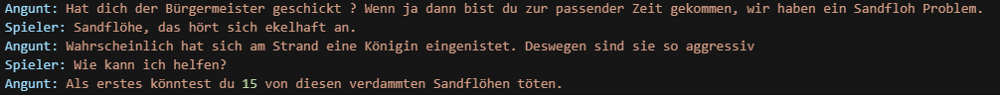
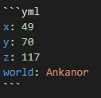
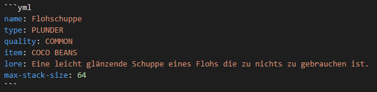
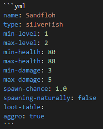

# Story und Quest Entwickler/Schreiber

Der Story und Quest Entwickler auch Questschreiber genannt, entwirft Storys und Quest für das Projekt. Hierbei nutzt er seine eigene Fantasie und kreativität um vorhandene Handlungsstränge fortzuführen oder neue hinzuzufügen. Um den [Quest-Skripter](./QUEST-DEVELOPER.md) bei ihrer arbeit, die fertig entworfenen Quest zu implemetieren, sollten Questschreiber die Quest in einem bestimmten Format, in einer Markdown Datei **(.md)** in den jeweiligen Questordner einfügen. Wie das vonstatten geht erklären wir euch in diesem Dokument.

* [Getting Started](#getting-started)
* [Der erste Schritt - Ordnerstruktur](#der-erste-schritt---ordnerstruktur)
* [Zweiter Schritt - Markdown Datei schreiben](#zweiter-schritt---markdown-datei-schreiben)
* [Issues](#issues)

## Getting Started

Um die `README.md` anlegen und bearbeiten zu können wird ein Account im [Gitlab von Faldoria](https://git.faldoria.de/) benötigt. Für einen Zugang bitte an `xanily` wenden.

Dort liegen auch die Ordner für die Questbearbeitung, bzw. dort werden sie abgelegt. Meist reicht es aus dort im Browser seine Datein zu bearbeiten, für alle die aber außerhalb des Browsers arbeiten wollen gibt es Editoren die das bearbeiten der Datein auch einfacher machen können. Wir empfehlen [Visual Studio Code](https://code.visualstudio.com/). Weiteres dazu auch hier unter [Tales of Faldoria Quests](../README.md).

Nun braucht es nur noch eine Idee, kreativität und motivation und schon kann man loslegen die Quest zu entwickeln.

## Der erste Schritt - Ordnerstruktur

Zunächst ist wichtig das überprüft wird ob es für das jeweilige Questgebiet schon die Ordnerstruktur vorhanden ist.  

Dies ist die Ordnerstruktur der Insel Anakanor. Sie ist aufgespalten in zwei Hauptordner `/ankanor` und `/ankanor-event`, dann gibt es noch die drei Unterordner welche für uns wichtig sind. `/einfache-npcs`, `/hauptquest` und `/nebenquest` 

| Ordner | Beschreibung |
| ------ | ------------ |
| `/einfache-npcs` | In diesem Ordner finden sich die Dokumente wieder, die für einzelne NPCs mit simplen Konversationen gedacht sind. [Beispiel NonQuestNPC](`noch einfügen`). |
| `/hauptquest` | Hier finden sich alle Dokumente wieder die zum Hauptstrang also der Hauptquest gehören. Dies sind die wichtigsten Quest, da sie den roten Faden darstellen. [Beispiel Quest README.md](.\example-quest\README.md) |
| `/nebenquests` | Dieser Ordner enthält alle Dateien die für Nebenquests benötigt werden, er ist wie `/hauptquest` angeordnet. |
| `README.md` | Hier finden wir die erste Datein im Markdown-Format welches ein Story und Quest-Entwickler geschrieben hat oder schreiben sollte. Es enthält diverse Informationen zum Questgebiet. [Beispiel Questgebiet.md](../quests/ankanor/README.md) |

Nun ist es wichtig einen Ordner für die Quest zu erstellen die du entwerfen möchtest, hierbei gilt, für jede Quest einen eigenen Ordner anzulegen.

Wie hier zu sehen haben die Ordner eine fortlaufende Nummer folgend des Questnamens getrennt durch Bindestriche. So wie für jede einzelne Quest ein Ordner angelegt wird, so ist in jedem Ordner eine Markdown Datei mit dem Namen `README.MD` 

> Hinweis: Lest das Thema [Issues](#issues), da an diesem Punkt die Issues interessant sind.

----

## Zweiter Schritt - Markdown Datei schreiben

Grundsätzlich sollen alle Markdown Dateien die entworfene Quest enthalten den selben aufbau haben. 

Zunächst eine Übersicht der einzelnen Punkte:

- [Titel der Quest](#titel-der-quest)
  - [Ablauf](#ablauf)
  - [Vorraussetzungen](#vorraussetzungen)
  - [NPCs](#npcs)
    - [NPC Name](#npc-name)
    - [Dialoge](#dialoge)
      - [Standartsätze](#standartsätze)
      - [Quest Dialog](#quest-dialog)
        - [Questname](#questname)
      - [Ausrüstung](#ausrüstung)
      - [Standort](#standort)
  - [Items](#items)
    - [Itemname](#itemname)
  - [Mobs](#mobs)
    - [Mobname](#mobname)
  - [Belohnung](#belohnung)
  - [Referenzen](#referenzen)

Nachfolgend nun die einzelnen Punkte mit einer kurzen Beschreibung über den Inhalt des Punktes und teilweise mit Beispielen.

---
---

# Titel der Quest

Dem Titel der Quest folgt eine kurze Inhaltsangabe der Quest. 

## Ablauf

1. Der Ablauf sollte in Aufzählungspunkten schritt für schritt erklären was passiert.
2. Auch ist es möglich gleich die einzelnen [NPCs](#npcs) und [Mobs](#mobs) zu verlinken.
3. Das ganze soll vom annähern am NPC bis hin zum erhalten der Belohnung in kurzen Sätzen beschrieben werden. 

## Vorraussetzungen

Dieser Punkt ist sehr wichtig! Hier sollen alle Vorraussetzungen, also alle Quest die vorher gemacht werden sollen, Level die erreicht werden sollten, Items die bei sich geführt werden sollten oder sonst jegliche Vorraussetzung die von nöten ist, aufgeführt werden. Auch mit Querverlinkungen zu Quest und der gleichen.

## NPCs

Unter NPCs finden sich alle NonPlayerCharaktere wieder die für die Quest relevant sind. Diese sind einzeln zu trennen.

### Angunt

Dem NPC Namen folgt eine Beschreibung des Charakters, hier können auch Fähigkeiten, Eigenschaften und Charakterzüge auftauchen. Umso mehr er beschrieben ist, umso besser auch für die Questgestaltung und die spätere implementierung ins Story Wiki etc.

### Dialoge

Die Dialoge sind mindestens zweigeteilt zum einen finden sich hier die Standartsätze und die eigentlichen Questdialoge wieder.

#### Standartsätze  

Standartsätze sind sind einfache Sätze die der NPC von sich gibt wenn man ihn anspricht. Diese Sätze sollten im Regelfall einen Teil der Geschichte der Welt, seine Story, Questhinweise oder sonstige interessanten Dinge beinhalten. 
Diese Dialoge können zu drei unterschiedlichen Zeiten passieren.

**Vor der Quest**
1. Dies passiert wenn der Spieler beispielsweise bestimmte Questvorraussetzungen noch nicht erfüllt.

**Während der Quest**  
1. Zu diesem Zeitpunkt ist es meist interessant wenn man dem Spieler Informationen oder Hinweise zur vom NPC gegebenen Quest gibt.

**Nach der Quest**
1. Das erfolgreiche Abschließen der Quest kann ihn Sätze führen die den Spieler an dieser erinnern wenn er den NPC noch mal anspricht.
2. Aber es kann auch unterschiedliche Dialoge geben, je nachdem wie der Spieler die Quest abgeschlossen hat, wenn es mehrere möglichkeiten gab bei den Entscheidungen.
    
#### Quest Dialog

Der Questdialog ist wohl wohl der Teil der am kompliziertesten und unübersichtlichsten der ganzen Markdown sein kann. Dies hängt aber auch davon ab wie kompliziert und ausführlich der Questentwurf selbst ist.

##### Questname

Nachfolgend des Questnamens ist meistens ein kurzer Dialog zu finden welcher in der Questannahme beziehungsweise ablehnung endet. 

Sobald eine Entscheidung getroffen werden kann sind diese wie folgt darzustellen.

1. Lässt den Spieler die Quest annehmen und bekommt noch ein "Viel Glück" vom NPC hinterher.
2. Lässt wiedrunm das Gespräch ohne Questannahme beenden.

Das selbe Prinzip gilt auch wenn der Spieler zurück zum NPC kommt und die Quest abgibt. Dies kann wie gesagt kompliziert werden wenn mehrere NPCs involviert sind, da diese ja auch getrennt sind, wenn man aber gut verlinkt etc. kann das viel Spaß machen so eine Komplizierte Quest zu schreiben.

#### Ausrüstung

Unter diesem Punkt soll angegeben werden welche Art Skin der NPC haben sollte, ob er etwas in der Hand hält oder gar Rüstung trägt.

#### Standort

Der Standort ist die einfache Angabe der Koordinaten des NPCs in einem bestimmten Format. 

## Items

Unter Items finden sich alle Items wieder die verwendet werden. Neue Items werden in der Quest beschrieben. Ist es ein schon vorhandenes ist die ID des Items anzugeben.

### Itemname

Nach dem exakten namen des Items folgt eine kurze Beschreibung des Items, ob es dropt oder verkauft wird, bzw. die relation zur Quest und wenn das Item schon vorhanden ist folgt die ID des Items. Des Weiteren folgt bei neuen Items eine Auflistung von Parametern in einem bestimmten Format.

Sollte es mehr als ein Item geben wird jedes einzelne getrennt angegeben.

## Mobs

Wie schon bei den Items finden sich hier alle in der Quest vorkommenden Mobs wieder. Ist der Mob schon vorhanden ist der Name und eine Referenz anzugeben wo der Mob schon mal verwendet worden ist.

### Mobname

Dem Mobnamen folgt in einem bestimmten Format einige Parameter. Zu beginn sind diese noch spekulativ einzutragen, mit der Zeit allerdings wird es gewisse Vorgaben bzw. Vorlagen geben zu welchem Zeitpunkt welche Parameter nicht über bzw. unterschritten werden sollten.

#### Ausrüstung

Unter diesem Punkt kann angegeben werden, sofern dieser Art von Anpassung möglichist, welche Waffe der Mob in der hand hält, welchen Skin er haben soll oder welche Rüstungen er trägt.

## Belohnung

In den Belohungen finden sich alle dinge wieder die der Spieler erhält wenn er die Quest abschließt. Hier ist alles möglich was die kreativität hergibt, doch es sollte im Regelfall einen Zweck dienen. Hinweis: Wenn hier Items vorkommen auch diese bitte hier mit ID angeben oder sollten sie hier angelegt worden sein zum jeweiligen Item verlinken.

Und hey, für das Lesen dieses Markdowns erhälst auch du was.
> 250 Ruf bei `Gott TheFum`  
> Den Titel `Questschreiber GitLord`  
> 3000 EXP für Teammitglied

## Referenzen

Unter den Referenzen können diverse dinge angegeben werden. Verlinkungen zu wichtigen Quests die hiermit zu tun haben, Forenbeiträge, die IssueID im Git, Karten, etc.  
Ich werde ein paar Links da lassen.

* [Beispiel Quest](../quests/ankanor/nebenquest/1-sandflohplage/readme.md) - Die von mir verwendete Quest für die Beispiele.
* [Markdown Formatierung](https://support.zendesk.com/hc/de/articles/203691016-Formatieren-von-Text-mit-Markdown) - Eine kleine Übersicht der Wichtigsten Formatierungen die verwendet werden. (Bessere Links bitte melden oder selbst eintragen)
* [Webinterface Items](https://app.faldoria.de/items) / [Forenlink](https://faldoria.de/board/index.php?thread/491-tof-webinterface-f%C3%BCr-admins/) - Hier befindet sich das Interface wo wir Items erstellen bzw. die Übersicht der Vorhandenen.
* [Faldoria Git-Issues](https://git.faldoria.de/groups/tof/-/issues) - Hier findest du alle Issues die in unserem Git erstellt worden sind. 

---
---

## Issues

Dieses Wort ist dir vielleicht schon das ein oder andere mal untergekommen, hier oder auch in anderen Dokumenten. Wir nutzen die Issues zur Dokumentation des Prozesses der gesamten Quest-Entwicklung, von der Idee bis zum aufspielen auf den Live-Server.  
Unter den Issues gibt es eine Kommentarfunktion sodass man auch direkt darüber kommunizieren kann wenn Fragen, Hinweise oder dergleichen auftauchen.

## Erstellen eines Issues

Wichtig ist das sollte es beim erstellen der Ordnerstruktur, bzw. des ersten Entwurfes kein Eintrag im Issue-Board zu der Quest geben, ist dieser anzulegen.

1. Hierzu einfach auf `New Issue` klicken.
2. Bei `Choose Template` Quest auswählen, dies gibt euch schon die die angelegte Vorlage für die Issues welche ihr nur noch ausfüllen müsst.
3. Titel der Issue ist `Ort: Questart [Name der Quest]`
4. Füllt eine kurze `Zusammenfassung` zu Beginn ein.
5. Ersetzt in der Vorlage das `Readme.md` im ersten Punkt mit dem Link zum Quest Ordner im Git
6. Assigned euch die Issue wenn ihr an der Quest selbst arbeitet.
7. Fügt den passenden Milestone hinzu, sofern vorhanden.
8. Klickt auf `Submit Issue`

Schon habt ihr ein Issue erstellt.

Nun arbeitet ihr an der Quest und gebt jedesmal wenn ihr Änderungen im Git speichert (comitted) die IssueID mit #ID im Kommentar zum commit an.

## Issue abschließen

Sobald ihr fertig seid müsst ihr die Quest zur Implementierung an die Quest-Skripter freigeben. 

1. Hakt die ersten beiden Punkte der Liste ab, sofern erledigt.
2. `Unassigned` euch selbst.
3. Fertig!