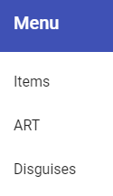
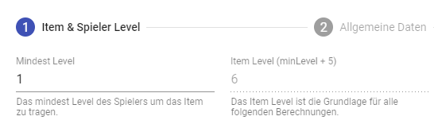

# Webinterface Guide <!-- omit in toc -->

- [Beschreibung](#beschreibung)
    - [Zugang](#zugang)
- [Items](#items)
    - [Items Wizard](#items-wizard)
- [ART](#art)
- [Disguises](#disguises)

# Beschreibung

Das [Webinterface](https://app.faldoria.de/home) ist eine Webseiten basierte Plattform, mit welcher Faldoria Teammitglieder die Möglichkeit haben Items und Skins für NPCs zu erstellen. Außerdem sind dort ____ zu finden. Grundsätzlich ist es jedem Teammitglied gestattet diese Tools zu nutzen, es ist sogar erwünscht. Dennoch ist es wichtig das alles kontrolliert passiert. Hierzu ist es wichtig Rücksprache mit anderen Mitgliedern zu halten. 

## Zugang

Um diese Plattform nutzen zu können benötigt ihr einen Zugang, ihr könnt euch auf der [Webseite](https://app.faldoria.de/home) einen Account erstellen, müsst aber noch eine PN im Forum mit euerer gewählten E-mail Adresse an @Silthus oder @xanily schicken.

Sofern ihr euch angemeldet habt seht, ist folgendes Menu zu sehen.

 

# Items

Der Bereich "Items" stellt die Plattform dar, auf welcher wir die unzähligen Items erstellen. Details zu Items findet ihr im [ITEMS-GUIDE](./ITEMS-GUIDE.md). Grundsätzlich ist das erstellen von Items mit dem Webinterface sehr intuitiv und es wird auch auf der Plattform schon gut erklärt.

## Items Wizard

# ART

# Disguises