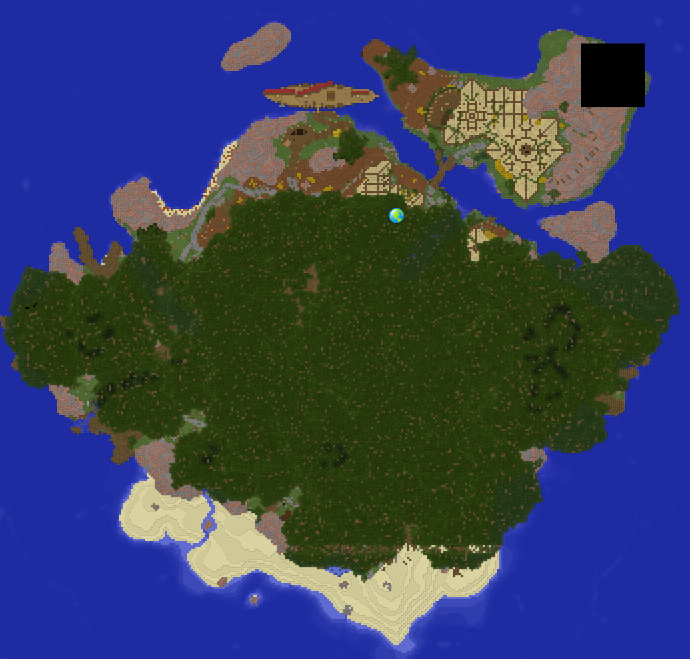

# Gebietsübersicht Ankanor <!-- omit in toc -->

- [Story](#story)
- [Fakten](#fakten)
- [NPCs / Monster](#npcs--monster)
    - [NonQuestNPCs](#nonquestnpcs)
    - [Mobs](#mobs)
- [Quests](#quests)
    - [Hauptquest](#hauptquest)
    - [Nebenquest](#nebenquest)
    - [Verwendete Quest Tags](#verwendete-quest-tags)
- [Vergebene Belohnungen](#vergebene-belohnungen)
    - [Quest Belohnungen](#quest-belohnungen)
    - [Verteilte Kisten](#verteilte-kisten)
- [Achievements](#achievements)
- [Referenzen](#referenzen)
    - [Gebietskarte](#gebietskarte)

## Story

## Fakten

|Faktenname| Beschreibung|
|---|---|
|**Gebietsnummer:**|0  |
|**Gebietslevel:**|0-3  |
|**Questzahl:**|5 Hauptquest / 5 Nebenquest  |
|**Spielzeit:**|Circa 2 Stunden|

## NPCs / Monster

> Gesamtliste aller NPCs - [siehe Referenzen](#referenzen)

### NonQuestNPCs

|Name         | Beschreibung| README|
| ---------------- | ---| ---|
|Händler|  | |
|Junzo | | |
|Kazui | | |
|Kozas | | |
|Lewis| Ängstlicher Kaishi Feldarbeiter | [Lewis Readme](./einfache-npcs/lewis/lewis.md) |
|Lutz| | | |
|Noromi| | |
|Patient| | |
|Sokensos| | |
|Syjin| | |
|Yoshni| | |
|Klisur| Der Bootsmann Klisur ist nicht mehr vorhanden, Dialog übernimmt Mafei| |

### Mobs

|Name         | Beschreibung| Ort|
| ---------------- | ---| ---|

## Quests

### Hauptquest

|Name/Git-Link         | Beschreibung| Sonstiges|
| ---------------- | ---|---|
|1. [Ein neuer Start](./hauptquest/1-ein-neuer-start/README.md)| Von Schicho zu Bürgermeister Roschik laufen. | Spieler lernt `ansprechen mit Rechtsklick`|
|2. [Vorräte für das Schiff](./hauptquest/2-vorraete-fuer-das-schiff/README.md)|Spieler sucht Kapitän Mafei und hilft ihm beim Füllen des Schiffslagers | |
|3. [Aufstieg zum Tianbaum](./hauptquest/3-aufstieg-zum-tianbaum/README.md)|Roschik schickt ihn den Tianbaum hinauf |Buff Speed 20% 3 Minuten beim Betreten des Baumes |
|4. [Klassenwahl](./hauptquest/4-klassenwahl/README.md)|Lious lässt den Spieler seine Klasse wählen und testen |Spieler lernt Klasse + Lernt mit Hotbar und Menü umzugehen |
|5. [Weitere Ausbildung](./hauptquest/5-weitere-ausbildung/README.md)|Spieler soll bei Jamos weitere Ausbildung erhalten, macht Nebenquests, versucht dann zum Schiff zu kommen. Landet dann an der Eisenküste| mögliches Achievment `Unversehrter Kaishi`|

### Nebenquest

|Name/Git-Link         | Beschreibung| Sonstiges|
| ---------------- | ---|---|
|1. [Sandfloh Plage](./nebenquest/1-sandflohplage/README.md)|Angut bittet den Spieler am Strand Sandflöhe zu töten |Vorraussetzung: Erledigt `HQ Klassenwahl` |
|2. [Material für die Schmiede](./nebenquest/2der-schmied/README.md)|Spieler soll Material aus einer Höhle auf der anderen Seite des Baumes holen |Vorraussetzung: Erledigt `HQ Klassenwahl` |
|3. [Skelette in der Höhle](./nebenquest/3-skelette-in-der-hoehle/README.md)|Die Höhle bei Genam beherbergt Skelette, diese soll der Spieler töten | Vorraussetzung: Angenommen `NQ Material für die Schmiede`|
|4. [Hilf in der Schmiede](./nebenquest/4-hilf-in-der-schmiede/README.md)|Zum Schmieden soll der Spieler Knöpfe und Hebel drücken |Vorraussetzung: Erledigt `NQ Material für die Schmiede` |
|5. [Hilf dem Lagerarbeiter](./nebenquest/5-hilf-dem-lagerarbeiter/README.md)| Das Lager an der Versammlungshalle ist fast leer, der Spieler soll sie für Kansa wieder füllen| |

### Verwendete Quest Tags 
|Tag | Auslöser/Beschreibung|
| --- | --- |
|ankanor.event.survivor| Bekommt der Spieler wenn er den [Ankanor Event](../ankanor/hauptquest/5-weitere-ausbildung/README.md) ohne zu sterben überlebt.|

## Vergebene Belohnungen

### Quest Belohnungen

|Belohnung (Insgesamt)       | erhalten durch| 
| ---------------- | ---|
|10 Steaks | Hauptquest `Ein neuer Start` |
|53 Heller |diverse Quest |
|55 EXP |diverse Quest |
|Abgetragene Hose|Hauptquest `Weitere Ausbildung` |
|10 verbrannte Steaks|Nebenquest `Hilf in der Schmiede`|
|2 Rote Äpfel|Nebenquest `Hilf dem Lagerarbeiter`

### Verteilte Kisten

|Kistenart | Ort/Beschreibung|
| --- | --- |

## Achievements

|Name | Beschreibung/erhalten durch|
| --- | --- |
|Unversehrter Kaishi |*Erreiche die Eisenküste ohne von Agnatus Schergen ausgeknockt worden zu sein.*|

## Referenzen

| Link           | Beschreibung|
| ---------------- | ---| 
|[GDoc - NPC Ankanor](https://docs.google.com/spreadsheets/d/1mz25MB9RLFfWyNtmPjpaAawuarKUtr-aXUGJ45zPEq4/edit) (`nicht Aktuell`) | Diese Liste enthält alle NPCs in einer Excel Tabelle. Hier enthalten sind unteranderem location, Skinabfrage, Beschreibung und mehr.|
|[Forum](https://faldoria.de/board/index.php?thread/390-00-ankanor-ankanor-event-aktuell/)| Link zum Forenthema Questgebiet `[00] Ankanor/Ankanor Event`|
|

### Gebietskarte

Ist veraltet, sobald was neues vorhanden ist wird aktualisiert.

