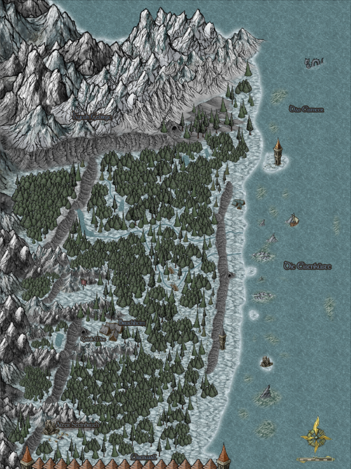

# Gebietsübersicht Eisenküste <!-- omit in toc -->

- [Story](#story)
- [Fakten](#fakten)
- [NPCs / Monster](#npcs--monster)
    - [NonQuestNPCs](#nonquestnpcs)
    - [Mobs](#mobs)
- [Quests](#quests)
    - [Hauptquest](#hauptquest)
    - [Nebenquest](#nebenquest)
    - [Verwendete Quest Tags](#verwendete-quest-tags)
- [Vergebene Belohnungen](#vergebene-belohnungen)
    - [Quest Belohnungen](#quest-belohnungen)
    - [Verteilte Kisten](#verteilte-kisten)
- [Achievements](#achievements)
- [Referenzen](#referenzen)
    - [Gebietskarte](#gebietskarte)

## Story

## Fakten

|Faktenname| Beschreibung|
|---|---|
|**Gebietsnummer:**|1  |
|**Gebietslevel:**|2-5  |
|**Questzahl:**|4 Hauptquest / 11 Nebenquest  |
|**Spielzeit:**|Circa 3 Stunden|

## NPCs / Monster

> Gesamtliste aller NPCs - [siehe Referenzen](#referenzen)

### NonQuestNPCs

|Name         | Beschreibung| README|
| ---------------- | ---| ---|
|Mairi|  | |

### Mobs

|Name         | Beschreibung| Ort|
| ---------------- | ---| ---|

## Quests

### Hauptquest

|Name/Git-Link         | Beschreibung| Sonstiges|
| ---------------- | ---|---|
|1. [Was ist passiert](./hauptquest/1-was-ist-passiert/README.md) | Erwachen an der Eisenküste, Marduk schickt Spieler auf Erkundung |  |
|2. [Reparaturarbeiten](./hauptquest/2-reparaturarbeiten/README.md)

### Nebenquest

|Name/Git-Link         | Beschreibung| Sonstiges|
| ---------------- | ---|---|
|  |   |  |

### Verwendete Quest Tags 
|Tag | Auslöser/Beschreibung|
| --- | --- |
|ankanor.event.survivor| Bekommt der Spieler wenn er den [Ankanor Event](../ankanor/hauptquest/5-weitere-ausbildung/README.md) ohne zu sterben überlebt.|
|eisenkueste.duty |Bekommt der Spieler wenn er anstatt `Elius` zu helfen nochmal zum Camp zurückkehrt und dort aushilft. |

## Vergebene Belohnungen

### Quest Belohnungen

|Belohnung (Insgesamt)       | erhalten durch| 
| ---------------- | ---|
|78 Heller  |diverse Quest  |
|90 EXP    |diverse Quest |
|Angerostetes Kettenhemd| [Reparaturarbeiten](.\hauptquest\2-reparaturarbeiten\README.md)|
|Zerrissener Lederwams |[Reparaturarbeiten](.\hauptquest\2-reparaturarbeiten\README.md)|
|Zerschlissene Robe|[Reparaturarbeiten](.\hauptquest\2-reparaturarbeiten\README.md)|

### Verteilte Kisten

|Kistenart | Ort/Beschreibung|
| --- | --- |

## Achievements

|Name | Beschreibung/erhalten durch|
| --- | --- |
|  |   |

## Referenzen

| Link           | Beschreibung|
| ---------------- | ---| 
|[GDoc - Ordner](https://drive.google.com/drive/folders/0B-4wSu3oC_hnfkF3Z2d1RjktOGxGMGVIZjNjY29NSDk1cE4tNVBCbHdMUWRERHBKLVBhNzQ) | Dies ist der GoogleDoc Ordner|
|[GDoc - NPC Eisenküste](https://docs.google.com/spreadsheets/d/1CPzWnv-ctPoIfWIPTYSVD8u0v45-Pg5osyw9VEzgqQg/edit) (`nicht Aktuell`) | Diese Liste enthält alle NPCs in einer Excel Tabelle. Hier enthalten sind unteranderem location, Skinabfrage, Beschreibung und mehr.|
|[Forum](https://faldoria.de/board/index.php?thread/391-01-eisenk%C3%BCste-aktuell/)| Link zum Forenthema Questgebiet `[01] Eisenküste`|
|

### Gebietskarte

